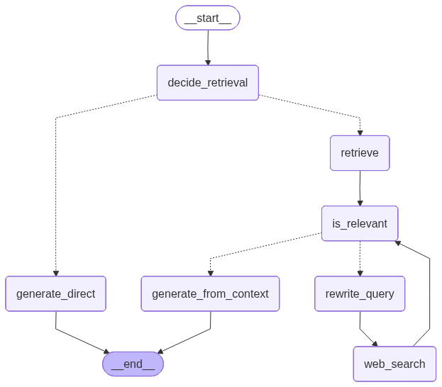

# Self-RAG Agentic AI System

A self-correcting retrieval-augmented generation (RAG) system built using LangGraph that dynamically decides when to retrieve, how to refine queries, and how to generate grounded responses.

---

## Problem

Traditional RAG systems:
- Always retrieve (even when unnecessary)
- Retrieve irrelevant data
- Lack self-correction
- Fail when initial retrieval is weak

---

## Solution

This system introduces an **agentic decision layer** that:

- Decides whether retrieval is needed  
- Filters irrelevant documents  
- Rewrites queries if retrieval fails  
- Falls back to web search  
- Generates answers using only validated context  

---

## Architecture



---

## Workflow

1. **Decide Retrieval**
   - Determine if external data is required  

2. **Direct Generation (if no retrieval)**
   - Answer using model knowledge  

3. **Retrieve Documents**
   - From PDF / vector database  

4. **Relevance Filtering**
   - Keep only useful documents  

5. **If not relevant**
   - Rewrite query  
   - Perform web search  
   - Retry retrieval  

6. **Generate Answer**
   - Use only validated context  

---

## Features

- Self-RAG decision system  
- Query rewriting loop  
- Relevance filtering  
- Hybrid retrieval (PDF + Web)  
- Agentic control flow using LangGraph  
- Reduced hallucination via structured prompts  

---

## Tech Stack

- Python  
- LangGraph  
- LangChain  
- FAISS (vector DB)  
- Sentence Transformers (embeddings)  
- Tavily (web search)  
- Ollama / OpenAI  

---

## Setup

### 1. Clone repo

```bash
git clone https://github.com/your-username/chat-with-pdf.git
cd chat-with-pdf
```

## 2. Install dependencies

pip install -r requirements.txt

## 3. Setup environment variables

Create `.env` file:

OPENAI_API_KEY=your_key_here  
TAVILY_API_KEY=your_key_here  

---

## Usage

Run the notebook:

jupyter notebook askmypdf.ipynb  

Example query:

"What is recursion in programming?"

---

## Example Flow

**Input:**

"Latest AI news in 2025"

**System will:**

- Detect need for fresh data  
- Rewrite query  
- Perform web search  
- Filter relevant sources  
- Generate grounded answer  

---

## Future Improvements

- [ ] Streaming responses  
- [ ] UI (Streamlit / Web app)  
- [ ] Multi-document support  
- [ ] Evaluation pipeline  
- [ ] Fine-tuned retrieval decision model  

---

## Positioning

This is not just a RAG system.

> It is a self-correcting, agentic retrieval system that improves its own search and reasoning loop.

---

## Contribution

Feel free to:

- Open issues  
- Suggest improvements  
- Extend modules  

---

## License

MIT License
